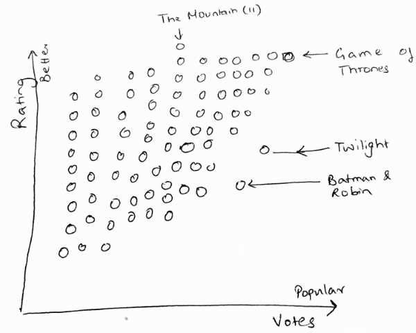

---
title: Visualizing data with JS templates
prefix: templates
...

Templates are a simple, powerful way of converting data into visual stories.

- **How does it work?** Instead of writing code to generate output, we write the output directly (e.g. in HTML or SVG), and set the attributes (e.g. color, position) based on data.
- **Why is this good?** It's simple. So it's easier to learn and remember. It's also easier to debug. And it's good enough for most cases.

In this tutorial, we will take the [Internet Movie Database data](https://www.imdb.com/interfaces/) and narrate a visual story using JavaScript templates.

The tutorial should take you about 1-2 hours to read and follow along.

1. [Decide what to build](#decide-what-to-build): 5 min
2. [Learn g1 templates](learn-g1-templates/): 10 min
3. [Render the design](imdb-template/): 20 min
4. [Add filters for preferences](interactive-filters/): 20 min
5. [Narrate stories](imdb-stories/): 20 min

## Decide what to build

**Pick your audience**. Our audience is the world of movie enthusiasts who are looking for good, popular movies to watch.

**Understand their objectives**. They want to know which movies to watch next.

- They're looking for movies with a high rating and a large number of votes.
- They prefer certain genres (e.g. action, animation), periods (e.g. latest movies, classics, black & white movies), etc.
- They're looking for guides that tell interesting stories about movies (e.g. how animations evolved over time.)

**Understand the data**. IMDb exposes [data files](https://www.imdb.com/interfaces/). We've extracted movies with 10,000 or more votes and simplified the structure. For each title, we have its:

- name (e.g. `"The Great Train Robbery"`)
- year of release (e.g. `1903`)
- genres (e.g. `"Action,Crime,Short"`)
- type (e.g. `movie`, `tvseries`)
- rating (as a weighted average of individual user ratings)
- number of votes from users

**Plan a solution**. Here's a rough design that will addresses their problem.

We show each movie (or group of movies) as a block. The ones on the right are popular (higher votes). The ones on top are better (higher rating).

Users can look at the top right for movies they should be watching.

Later, we'll allow them to filter the filter by their interest, and we'll create a series of stories from these.

## Exercises

### Design: Which food to eat?

[MyPyramid Food Raw Data](https://catalog.data.gov/dataset/mypyramid-food-raw-data-f9ed6) - Food_Display_Table.xlsx provides food nutrition information for ~2,000 food items.

Your audience is the health-conscious public who want to pick healthy food in line with their diet (e.g. no sugar, no carbs, no meat) and their taste (e.g. desserts, snacks, breads, etc).

Create a design that helps them pick what to eat next.

### Design: Which car to buy?

[Used Car Listings](https://www.kaggle.com/jpayne/852k-used-car-listings) lists 1.2 million used cars afor sale, along with their price, year of manufacture, model, mileage, etc.

Your audience is the value-conscious used car buyer who wants to pick the right car for them based on value for money (which listing has a lower price for the same model and mileage), and in line with their preference (e.g. in a city near my, by my preferred manufactured).

Create a design that helps them find which car to buy.

-----------

[Next: Learn g1 templates &raquo;](learn-g1-templates/){: class="btn btn-lg btn-success my-4"}
